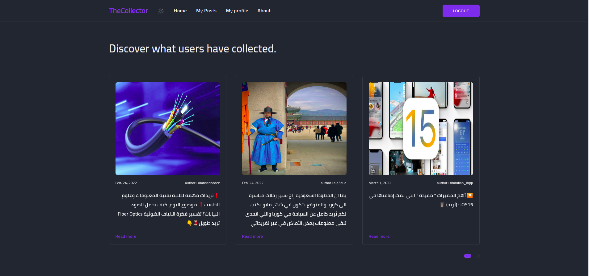

<p align="center">
  

  <h3 align="center">Collector App</h3>

  <p align="center">
      Blog and twitter bot to pull tweets chains into blog post to read/save easily
  </p>
</p>

## Screenshots


<h3 align="center">folder structure</h3>
<p align="center"></p>
<br>
<h3 align="center">different screenshots</h3>
<h3 align="center">Dark</h3>
<p align="center"></p>
<p align="center"></p>
<h3 align="center">Light</h3>
<p align="center"></p>
<h3 align="center">Mobile</h3>
<p align="center"></p>
<h3 align="center">PDF</h3>
<p align="center"></p>
<h3 align="center">Settings</h3>
<p align="center"></p>
<p align="center"></p>
<h3 align="center">Bot logs</h3>
<p align="center"></p>
<br>

## Usage

1. Clone the repo

   ```sh
   git clone https://github.com/civilcoder55/django-collector-app.git
   ```

2. update env file

   ```sh
   cp .env.example .env
   ```
3. you may need to edit some configurations in docker-compose.yml like ports

4. run containers

   ```sh
   docker-compose up -d
   ```

5. access website at
   ```sh
   http://127.0.0.1:8000
   ```

## Features

- pulling tweets chains into blog post.
- authentication system.
- twitter oauth for login and linking account.
- two factor authentication with otp.
- comment, like, dislike posts.
- save post as pdf.
- websocket notification on new collected tweets.
